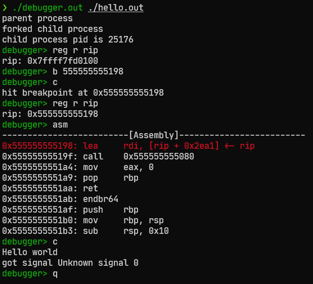

mini debugger
---

A x86-64 linux debugger based on ptrace.

## Build

Before starting anything, we will need to setup submodule [capstone](https://github.com/capstone-engine/capstone) first.

```
$ git submodule update --init   // download the capstone repo
$ cd reference/capstone
$ sudo ./make.sh install        // set up the capstone repo and install disassembler
```

Then we can build our debugger with dependencies.

```
$ make
```

## Run

Just run the debugger with the program.

```
$ ./debugger.out <program>    // ex: ./debugger.out ls -al
```

## Test

It's interesting to use `objdump` and `cat /proc/<pid>/maps` to find func call information in elf, and then test it with breakpoint.

```
$ make test
$ ./debugger.out ./hello.out
```



## Command

The mini debugger has been implemented a small set of command, which can let you do some simple trace on the debuggee.

| Command    | Description                                  |
| ---------- | -------------------------------------------- |
| help       | show all command usage                       |
| quit       | close the subprocess and end the debugger    |
| breakpoint | set a breakpoint at specified address        |
| register   | read/write registers                         |
| memory     | read/write memory                            |
| step       | execute an instruction                       |
| continue   | run until the next breakpoint is encountered |
| asm        | show instructions                            |

## Reference
- [writing a linux debugger](https://blog.tartanllama.xyz/writing-a-linux-debugger-setup/)
- [ptrace source code](https://github.com/torvalds/linux/blob/master/kernel/ptrace.c)